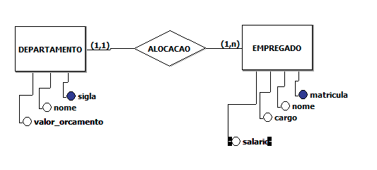

departamento (**sigla**, nome, valor_orcamento);
  - **sigla** CHAVE PRIMARIA;

empregado (**matricula**, departamento_id, nome, cargo, salario);
  - **matricula** CHAVE PRIMARIA;
  - **departamento_id** REFERENCIA departamento(**sigla**);