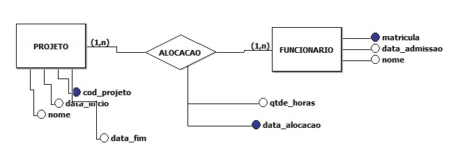

projeto (**codigo_projeto**, nome, data_inicio, data_fim);
  - **codigo_projeto** CHAVE PRIMARIA;

alocacao (**data_alocacao**, funcionario_id, projeto_id, quantidade_horas);
  - **data_alocacao** CHAVE PRIMARIA;
  - **projeto_id** REFERENCIA projeto(**codigo_projeto**);
  - **funcionario_id** REFERENCIA funcionario(**matricula**);

funcionario (**matricula**, data_admissao, nome);
  - **matricula** CHAVE PRIMARIA;